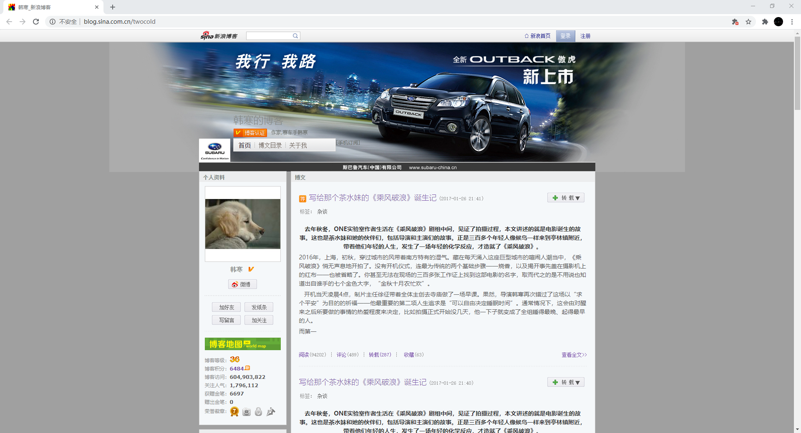
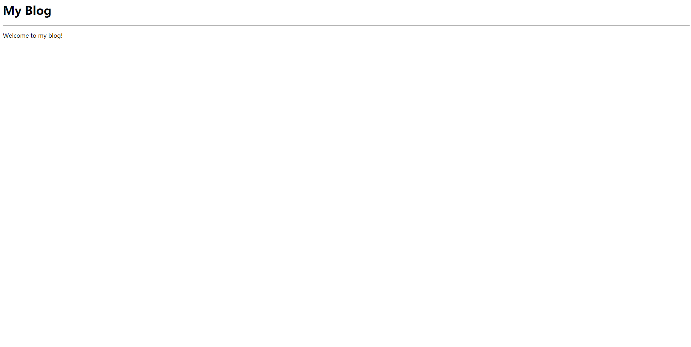

<h1>简单的主页</h1>

经常使用浏览器的人，对“网页”一定不陌生。下面是一个新浪博客的页面。

<hr>



<hr>


那么这些内容是怎么在我们的浏览器里显示出来的呢？我们先不探寻具体的原理，我们先来在浏览器里显示一个我们自己做的页面。

具体步骤如下：

1. 创建一个后缀名为.html的文件（例如：index.html）

2.  使用文本编辑器打开这个文件

3. 在这个文件中输入使用HTML标注好的内容（例如:  <a href="#simple_html_sample">简单的HTML内容</a>）

4. 使用浏览器打开这个文件


<h2 id="simple_html_sample">简单的HTML内容</h2>

```html
<!-- index.html -->
<html>
    <head>
        <title>My Blog</title>
    </head>
    <body>
        <h1>My Blog</h1>
        <hr>
        <p>Welcome to my blog!</p>
    </body>
</html>
```

<h2>浏览器看到的内容</h2>



你可能会问，<a href="#simple_html_sample">简单的HTML内容</a>里的东西是什么。简单但不准确的说，我们使用HTML这个文本标记语言告诉了浏览器该如何显示我们创建的文件。其中的\<html\>、\<head\>等用“<”和”>“和英文字母以及“/"组成的东西叫做“标签”（Tag），标签用来标记文本内容是什么，例如：\<p\>标签标记了”Welcome to my blog!“这个文本是一个段落。具体学习HTML的知识可以通过<a href="https://zh.wikipedia.org/wiki/HTML">HTML的维基百科</a>、<a href="https://www.w3schools.com/html/default.asp">w3cschools的HTML教程</a>或<a href="https://www.runoob.com/html/html-intro.html">菜鸟教程的HTML教程</a>进行学习。

