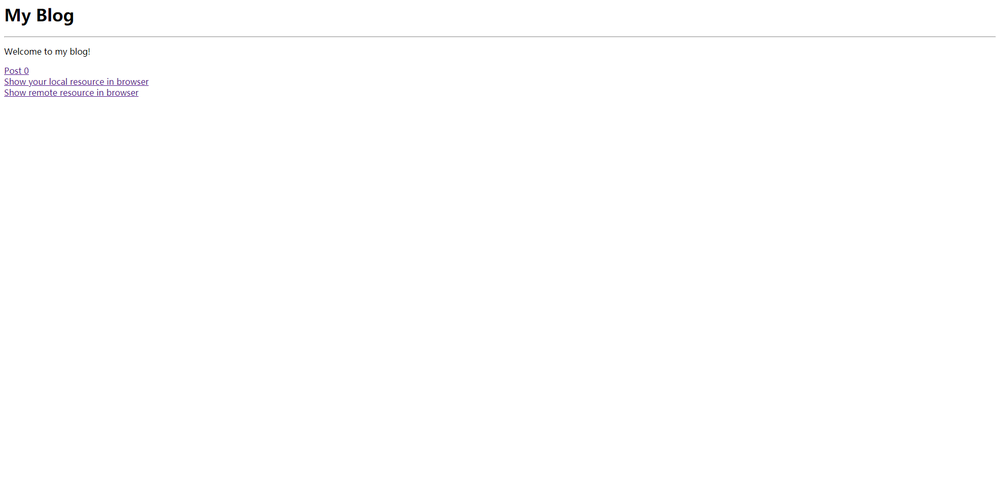

<h1>页面的美化</h1>

现在我们能够在浏览器中显示我们制作的网页了，但是，很显然，我们的页面不够美观。我们需要对我们的页面进行美化，为了达到这个目的，我们需要使用新的东西，叫做“层叠样式表”（CSS）。

<h2>CSS</h2>

* CSS是什么：层叠样式表（英语：Cascading Style Sheets，缩写：CSS；又称串样式列表、级联样式表、串接样式表、阶层式样式表）是一种用来为结构化文档（如HTML文档或XML应用）添加样式（字体、间距和颜色等）的计算机语言，由W3C定义和维护。目前最新版本是CSS2.1，为W3C的推荐标准。[来源请求]CSS3现在已被大部分现代浏览器支持，而下一版的CSS4仍在开发中。[<sub>[1]</sub>](#wikipedia_css)

* 为什么要使用CSS：对HTML元素的外观进行定制。

* 怎么使用：在HTML文件中引入CSS定义样式。有以下方式：

  * 内联方式：在标签的style属性中设置元素的样式。
  * 嵌入方式：在HTML文件中使用\<style\>标签，并用该标签标记样式文本。
  * 链接方式：在HTML文件中使用\<link\>标签，并设置好该标签的属性。
  * 导入方式：在HTML文件中使用\<style\>标签，并使用“@import"语法将CSS文件进行导入。

  可以参考<a href="https://www.w3schools.com/css/css_howto.asp">w3cschool</a>或<a href="https://www.runoob.com/w3cnote/html-import-css-method.html">菜鸟教程</a>。

* 如何写样式？

  你需要学些CSS的知识，例如：选择器、声明、值。

<h2>美化的例子</h2>

比如我想把我的<a href="../index.html">index.html</a>美化。

美化前是这样：



想美化成这样：


我要通过链接方式在index.html中引入我所定义的样式的步骤：

1. 在css文件夹下创建simple_css.css文件并在文件中写好我定义的<a href="#simple_css">样式</a>。
2. 在index.html中使用\<link\>标签并保存<a href="#new_index_to_beautify">修改</a>。

注意：.css文件不一定要放到css文件下，我之所以这么放只是为了方便组织文件。

<h3 id="simple_css">simple_css.css的内容</h3>

```css
h1
{
text-align: center;
text-transform: uppercase;
color: gray;
}
p, a
{
text-indent: 50px;
text-align:justify;
letter-spacing:3px;
}
a
{
text-decoration:none;
}
```

这里面的h1, p, a是属于CSS定义的一类“选择器”，text-align等在“:”左侧的东西叫做“属性”，center等在“:”右侧的东西叫做“值”。

<h3 id="new_index_to_beautify">修改后的index.html</h3>

```html
<html>
    <head>
        <link rel="stylesheet" href="./css/simple_css.css">
        <title>My Blog</title>
    </head>
    <body>
        <h1>My Blog</h1>
        <hr>
        <p>Welcome to my blog!</p>
        <a href="./posts/post0.html">Post 0</a>
        <br>
        <a href="./posts/use_tags_to_show_your_local_resource_in_browser.html">Show your local resource in browser</a>
        <br>
        <a href="./posts/use_tags_to_show_remote_resource_in_browser.html">Show remote resource in browser</a>
    </body>
</html>
```

<h3>使用他人定义好的样式 </h3>

和电脑主题，手机主题一样，我们可以用别人做好的网页“主题”来美化我们的网站。方法就是引入别人用CSS写好的样式。最简单的，你可以随便创建一个.html文件，然后在通过链接方式引入我写好的simple_css.css文件，这样你就可以使用我的写好的样式。

<a href="https://getbootstrap.com/">BootStrap</a>、<a href="https://ant.design/index-cn">Ant Design</a>、<a href="https://element.eleme.cn/#/zh-CN">Element</a>可以让我们使用到很多别人定义好的样式。不过使用Ant Design、Element之前，最好学习一些<a hreft="https://www.w3schools.com/js/">JavaScript</a>的知识。BootStrap等属于前端用户界面（UI）框架（Framework）。以我的角度来看，不要将“框架”这个词想得太高端太复杂，想大概了解框架是什么，可以参考这个知乎回答：<a href="https://www.zhihu.com/question/29643471/answer/249430318">库，框架，架构，平台，有什么明确的区别？ - ze ran的回答 - 知乎 </a>。

虽然使用他人定义好的样式会很方便，但我建议有空的时候自己多多写写HTML、CSS、JavaScript代码，来增进对知识的应用能力。使用框架的时候我建议要想一想为什么需要这个框架，这个框架解决了什么问题，这个框架是如何解决这些问题的，原理是什么。

总之，多动手，多去探求原理，不要死记硬背比较好。

<h2>参考</h2>

<li id="wikipedia_css">[1]层叠样式表：https://zh.wikipedia.org/wiki/%E5%B1%82%E5%8F%A0%E6%A0%B7%E5%BC%8F%E8%A1%A8</li>

